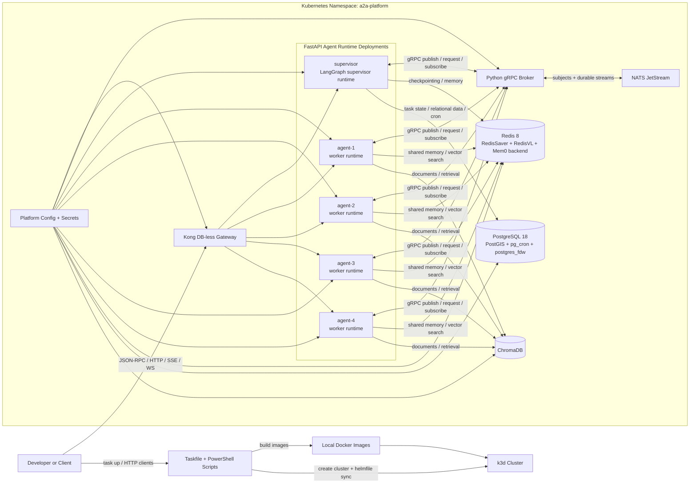

# System Architecture Diagram

This note stores the Mermaid system architecture diagram for the `distributed/` multi-agent Helm scaffold.

## Notes

- External traffic enters through `Kong`.
- Each agent runtime exposes A2A-style JSON-RPC, synchronous invoke, NDJSON streaming, SSE, WebSocket, and stdio bridge endpoints.
- Agents do not talk to NATS directly. They use the internal gRPC broker facade.
- `Redis` is the hot state and agent-memory layer.
- `PostgreSQL` is the relational and scheduled-work layer.
- `ChromaDB` is the shared retrieval store.

## Relations

- part_of [[Project Index]]
- documents [[Distributed A2A Helm Scaffold]]

## Evolution Log

| Date | Change | Reason | Trigger |
|------|--------|--------|---------|
| 2026-05-28 | Frontmatter normalized (entity_type, status, created, modified; namespaced tags, `diagram`/`mermaid` → `artifact/diagram`); added Relations block. | Note lacked required frontmatter and graph links. | KB curation sweep — projects/ partition. |
